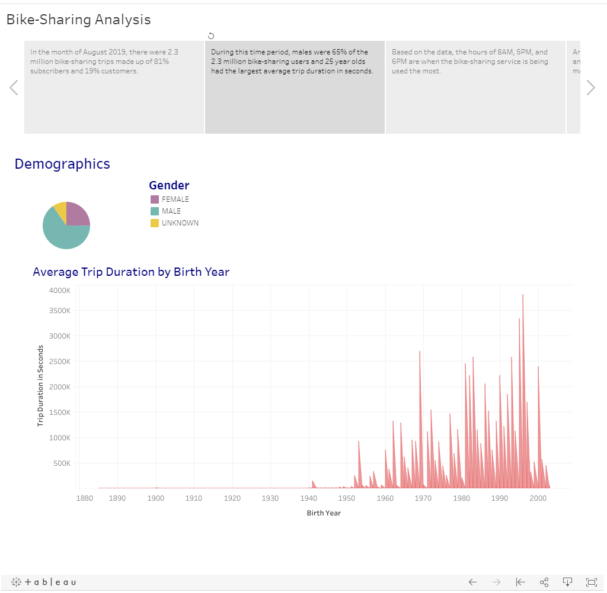

# Bike-Sharing Analysis

## Overview of Bike-Sharing Analysis

### Purpose

##### The purpose of the Bike-Sharing Analysis is to utilize Tableau to create data visualizations and present the data in a series of worksheets, dashboards, and stories to determine if a bike-sharing service could be launched in Des Moines, Iowa based on New York City data for the month of August 2019.

### Results

##### To visit the Bike-Sharing Analysis, please visit the Tableau Story located here: [Bike-Sharing Analysis performed by Melinda Malone](https://public.tableau.com/views/Module14Challenge_16272432139490/Bike-SharingAnalysis?:language=en-US&publish=yes&:display_count=n&:origin=viz_share_link)

### Summary

##### In summary, it is my opinion that additional analysis should be performed on the population of Des Moines, Iowa such as demographics of the population as a whole and the demographics of the workforce to determine if the bike-sharing success in NYC could be replicated to some degree in Des Moines.  Based on the bike-sharing analysis of the NYC data, it was determined that males were 65% of the bike-sharing users in a month's timeframe while females were at 25% and unknown gender at 10%.  Also it was determined that twenty-five year olds had the largest average trip duration measured in seconds.  The average trip duration in seconds steadily increased as the age of the rider decreased.  Finally, the hours of 8AM, 5PM, and 6PM were identified as the busiest hours of bike-sharing use especially during the weekday which is indicative that bike-sharing users are heavily using the bikes to commute to-and-from work.  Therefore the additional analysis of the Des Moines demographics as a whole and of the workforce would aid in determining the male to female ratio, the age composition of its residents, and the characteristics of the Des Moines workforce.  It would also be advantageous to determine where NYC bike-sharing users are from to determine how many users are actual NYC residents versus how many are visitors to the city.
